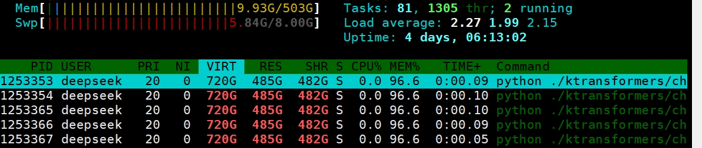
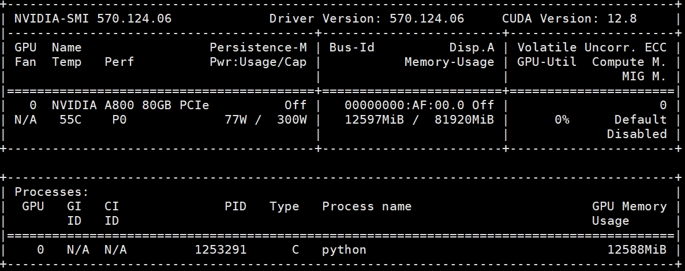
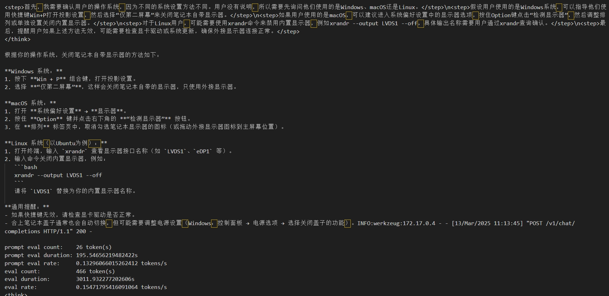
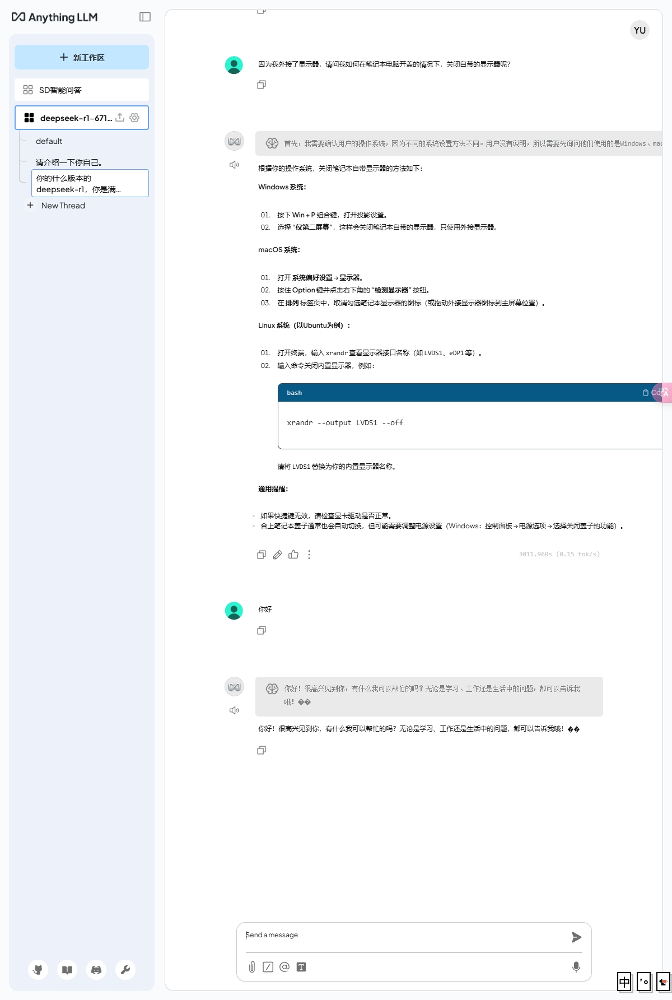

# ktransformers部署Deepseek-r1满血版结合AnythingLLM工具，支持知识库调用
##  源码位于master分支
### 基于官方版本v0.2.1修改的Ktransformers，支持流式返回，兼容OpenAI接口格式

- 修改了  `./ktransformers/util/utils.py` 文件，将生成方法新增变量，带有可选的流式返回
- 基于官方的local_chat.py，结合Flask框架，实现了兼容OpenAI的流式接口，位于文件  `./ktransformers/chat_openai.py`
- 注意需要将chat_openai.py中的关于Deepseek模型配置和模型权重文件分开存放（关于配置文件和权重文件，huggingface、魔塔社区等开源社区都有，我使用的是guff格式的模型权重）
- 

### 部署条件
- 我部署的版本是Deepseek-R1-671b-Q8，该版本相较与满血版的Deepseek性能损失最小，8位精度版本的性能损失基本可以忽略不计（美团给出过证明）
- 需要713G上下的内存（这里我的内存不够，采用了虚拟内存，严重拖慢速度，时间都花在交换区交换数据上了）
- 
- 显存仅需14G，没有对显卡有很高的要求
- 
- 这里我对我的本地部署的Deepseek本地测试了一下，效果如图，该配置还是适合Q4版本
- 

###  痛点问题
-  按照官方给的教程安装了Ktransformers，并且在上面部署了Deepseek之后，按照官方的demo启动了我的本地大模型，成功搭建了大模型底座
-  但是对于工程而言，一个底座还是不够，需要上层服务提供如文件读取、知识库整合等功能，当前已经有许多成熟的工具。
-  例如：Anythingllm、dify
-  我使用的是本地化部署的Anythingllm，可以无缝衔接采用Ollama部署的本地大模型，但是对于Ktransformers部署的大模型不能直接被使用
-  截止目前，我还没有发现Ktransformers官方有支持流式响应生成，local_chat.py只能流式打印在控制台上，不能用接口返回

###  解决方案
-  由于Anythingllm这个工具可以支持一切兼容OpenAI接口规范的接口，于是我们需要将基于Ktransformers部署的deepseek封装为兼容OpenAI的接口提供服务
-  这里我采用了Deepseek的官方的接口，通过调用官方接口，获取流式响应的结果，依据该结果封装接口
-  最后需要解决的是Ktransformers的生成方法中是待全部tokens都生成后，再返回，这和流式方法是不兼容的，于是需要修改`./ktransformers/util/utils.py`中的prefill_and_generate方法
-  将prefill_and_generate方法的生成方式修改为，生成一个token就返回一次内容，以实现流式返回

###  Anythingllm调用结果展示
-  
